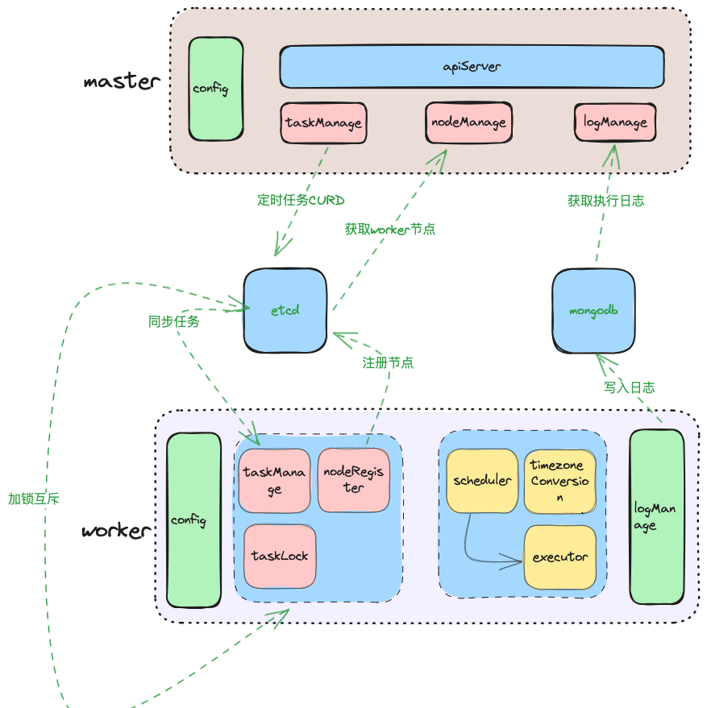

# 介绍

go-cron 是基于golang实现统一定时任务平台。




## 安装
```shell
# 后端
git clone https://github.com/jami1024/go-cron

# 前端 
git clone https://github.com/jami1024/go-cron-web

```
## 修改服务端配置
编辑config/config.json 根据实际情况修改etcd.address


## 运行 docker compose
```
# 构建go-cron docker镜像
cd go-cron && docker build -t go-cron-server:latest .

# 构建go-cron-web docker镜像
cd go-cron-web && docker build -t go-cron-web:latest .

# 运行docker compose,
cd go-cron && docker compose up -d

注意：docker compose集成etcd、go-cron-web(前端程序)、go-cron(后端程序)
```

## 运行worker
编辑config/worker.json，根据实际情况修改etcd.address、etcd.zk。

**etcd.zk对照表：**
|前端显示|worker显示|
|---|---|
|国内|bjzk|
|日本|jpzk|
|欧美|uszk|
|韩国|krzk|

```
# 运行worker
go run cmd/worker/main.go
```
## 前端项目
[go-cron-web](https://github.com/jami1024/go-cron-web)


